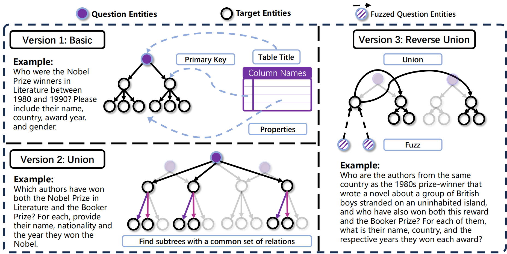
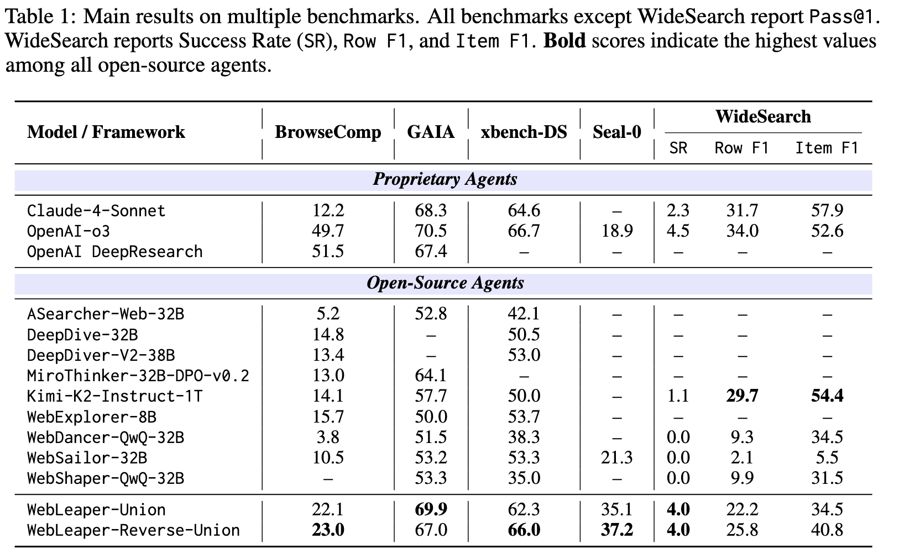

WebLeaper: Empowering Efficient, Info-Rich Seeking for Web Agents

  

💡 Introduction
* WebLeaper is a data+training framework that makes web agents both effective and efficient at information seeking (IS).
* Key idea: today’s IS agents waste many steps because training tasks contain sparse targets, so agents learn shallow, meandering search. WebLeaper fixes this with entity-intensive tasks and efficiency-aware trajectory curation.
* We cast IS as tree-structured reasoning and synthesize three data variants—Basic, Union, and Reverse-Union—to progressively increase entity density, cross-source reasoning, and anti-shortcut robustness.
* We filter trajectories with Information-Seeking Rate (ISR) for coverage and Information-Seeking Efficiency (ISE) for action economy, keeping only those that are accurate and fast.
* Extensive experiments on BrowseComp, GAIA, Seal-0, WideSearch, and xbench-DeepSearch show consistent gains over strong open and proprietary baselines.

---

🚀 Highlights
* Entity-Intensive Tasks: Pack many targets into compact contexts to teach efficient retrieval.
* Three Synthesis Modes:
  * Basic: Single-table, high-density tasks.
  * Union: Multi-source, structure-aligned fusion for realistic synthesis.
  * Reverse-Union: “Fuzzed” anchors that force deduction before cross-source search—no keyword shortcuts.
* Efficiency-Aware Curation: Keep only trajectories with high ISR and high ISE.
* Strong Open-Source Results: Strong improvements across 5 IS benchmarks with fewer actions per success.

  

---

📦 Dataset & Task Design

WebLeaper constructs IS tasks from curated Wikipedia tables and cross-table unions:
* Tree-Structured IS:
  * Root (question entity) → 2nd layer (key entities) → 3rd layer (attributes/linked entities)
  * Each 2nd-layer node + its attributes forms a subtree; tasks require retrieving final and intermediate entities.
* Variants
	1.	Basic: Build a single-source tree from one well-formed table; dense targets in a constrained context.
	2.	Union: Detect maximal unions among trees that share relations (modeled as maximal biclique enumeration) to create multi-source synthesis questions.
	3.	Reverse-Union: Provide attribute-level clues to deduce a hidden anchor entity first, then pivot (e.g., nationality) to launch a union-style search.

> Result: Tasks that reward efficient exploration, resist keyword shortcuts, and stabilize metric estimation as target count grows.

---

📐 Metrics: Measuring Coverage & Efficiency
* Information-Seeking Rate (ISR): fraction of required entities retrieved.
$$\mathrm{ISR} = \frac{|R\cap O|}{|R|}$$
* Information-Seeking Efficiency (ISE): targets per action steps (measured primarily on Visit actions).
$$\mathrm{ISE} = \frac{|R|}{T}$$
* Stability: As the number of targets n increases, $Var(ISE) = O(1/n)$, yielding reliable efficiency signals during training.

---

🛠️ Trajectory Construction

We generate many trajectories with a tool-using agent (within ReAct) and keep only those that meet:
* Coverage: $\mathrm{ISR} > \alpha$
* Efficiency: $\mathrm{ISE} > \beta$

Tools
* Search(queries, filter_year) → web results + snippets
* Visit(urls, goal) → summarized paragraphs, from which entities are extracted

Why exclude Search in ISE? Entities seen in Search are less precise and typically refined by subsequent Visit, so Visit actions better reflect useful collection.

---

📊 Performance

  

* On BrowseComp, GAIA, Seal-0, WideSearch, xbench-DeepSearch, WebLeaper delivers consistent gains over competitive baselines.
* Reverse-Union data often outperforms Union.
* Against larger agents, WebLeaper’s training design yields stronger efficiency–effectiveness trade-offs.

In ablations, combining WebLeaper data with a small amount of deep-search data (e.g., WebSailor-V2) preserves long-horizon skills while boosting efficiency.

---

🔍 Method Details

1) Basic (Single-Source, Dense)
   * Mine large, homogeneous Wikipedia tables.
   * Root from table title; primary key columns → 2nd-layer; other columns → 3rd-layer attributes.
   * Build compact, high-coverage tasks that maximize valid actions.

2) Union (Multi-Source, Structured)
   * Identify maximal unions between trees sharing relation sets (e.g., has_nationality, has_name).
   * Synthesize questions that require intersection/union across sources (e.g., “authors who won both Prize A and Prize B”).

3) Reverse-Union (Deduction → Expansion)
   * Provide fuzzed clues at attribute level to force anchor deduction (no direct keywords).
   * Use a pivot attribute (e.g., country) to launch a union search over other trees.

---

⚙️ Training & Inference
   * Backbone: Qwen3-30B-A3B-Thinking (example base).
   * Data Mix: WebLeaper (Basic / Union / Reverse-Union) + a small set of deep-search data to retain long-horizon browsing capability.
   * Trajectory Filters: thresholds \alpha (ISR) and \beta (ISE) tuned for balanced coverage and efficiency.
   * Sampling: temperature =0.6, top-p =0.95 during inference (typical setting).

---

🙌 Acknowledgements

WebLeaper builds on prior advances in web agent training, entity-rich task synthesis, and ReAct-style tool use. We thank the authors of the evaluated benchmarks and the maintainers of open-source toolchains used in our pipeline.